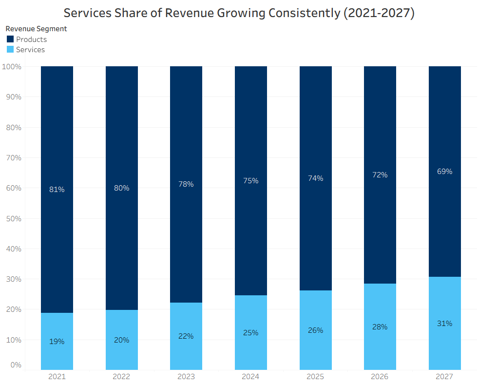
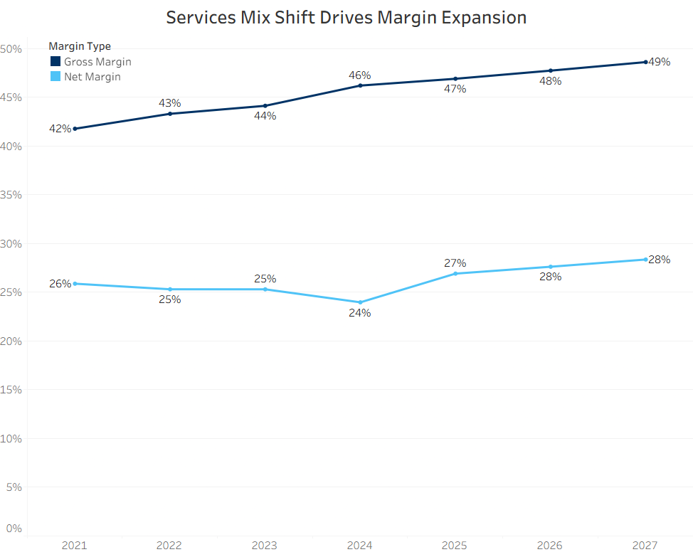
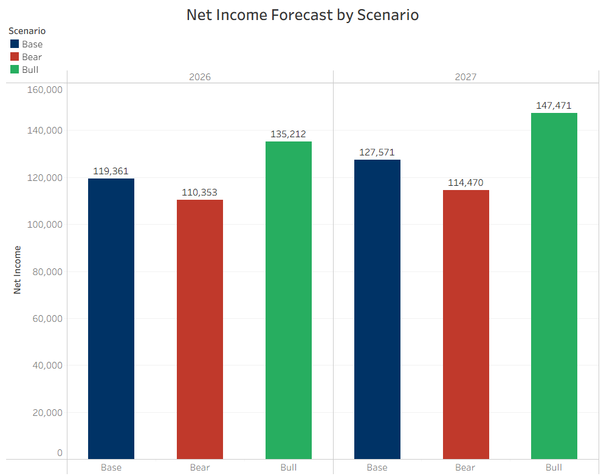
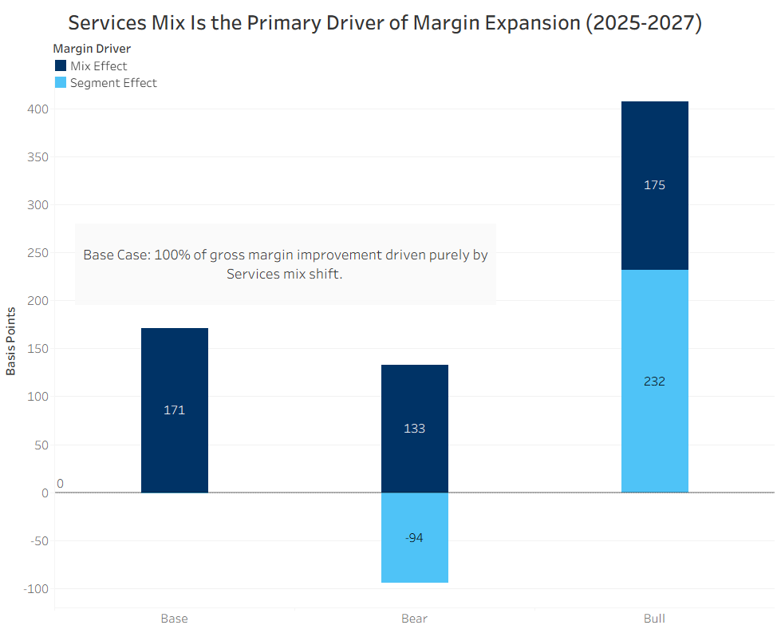
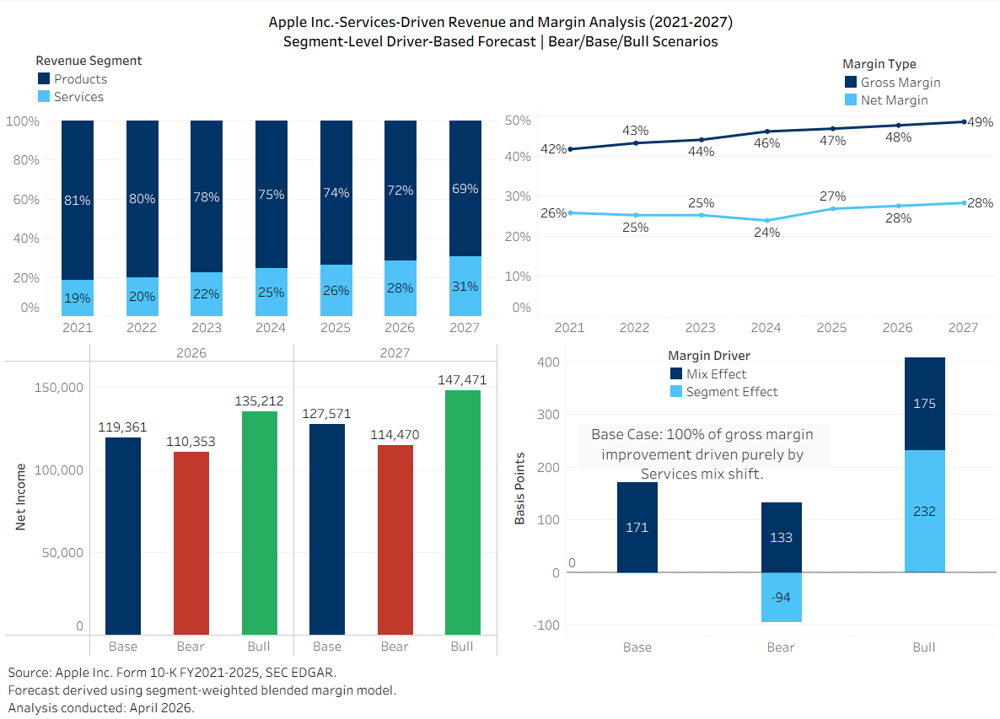

# Apple Inc. - Services-Driven Revenue and Margin Analysis (FY2021-2027)

## Segment-Level Driver-Based Forecast | Bear/Base/Bull Scenarios


## Project Overview

This project analyzes Apple Inc.'s financial perfomance between FY2021 and FY2025
using SEC EDGAR Form 10-K filings. The analysis focuses on revenue growth,
segment mix shift, margin expansion, and scenario-based forecasting to evaluate
how Apple's Services segment influences long-term profitability.
The project combines Excel-based financial modelling with Tableau visualizations
to produce an executive-style analytical report.

---

## Business Question

> *"Analyze Apple Inc.'s revenue mix over the past 5 years to assess
> whether growth in Services is off-setting Products stagnation, and
> evaluate the potential impact of this shift on net margins through 2027"*  

---

## Key Findings

| Metric | FY2025 Actual | FY2027 Base Case |
| -------- | -------------- | ----------------- |
| Services Mix % | 26.23% | 30.65% |
| Blended Gross Margin | 46.91% | 48.61% |
| Net Margin | 26.92% | 28.36% |
| Net Income | $112,010M | $127,571M |

---

## Objectives

- Analyze Apple's revenue growth trends.
- Compare Products vs Services perfomance.
- Examine revenue mix evolution.
- Evaluate gross margin expansion drivers.
- Build scenario-based forecasts for FY2026 and FY2027.
- Visualize financial trends using Tableau.

---

## Dataset and Source

Source:

- Apple Inc. Form 10-K Annual Reports (FY2021-FY2025).
- SEC EDGAR Database.

All figures were standardized into USD millions.

---

## Tools Used

- Microsoft Excel.
- Tableau.
- SEC EDGAR.
- GitHub.

---

## Repository Structure

```text
apple-financial-analysis/
├── data/
│   ├── processed/          # Cleaned Excel model
│   └── raw/                # Source 10-K filings
├── tableau/                # Tableau workbook (.twbx)
├── visualizations/         # Dashboard screenshots
└── README.md
```

## Methodology

### 1. Data Collection

Financial statement data was manually extracted from Apple's annual 10-K filings.

### 2. Data Cleaning and Structuring

- Standardized values into USD millions.
- Organized segment-level revenue and profitability metrics.
- Calculated contribution percentages and growth rates.

### 3. Financial Analysis

The project evaluates:

- Revenue growth trends.
- Services vs Products dynamics.
- Revenue contribution mix.
- Gross margin expansion.
- Net margin evolution.

### 4. Forecasting

A driver-based forecasting model was built using:

- Historical CAGR analysis.
- Scenario assumptions.
- Segment-level margin projections.
- Revenue mix attribution analysis.

---

## Key Insights

### Revenue Growth

- Services revenue achieved a 12.39% 4-year CAGR between FY2021-FY2025 outpacing total revenue growth of 3.28%.
- Products revenue peaked at $316,199M in FY2022 declining 2.9% to $307,003M by FY2025 - peak-and-decline not mere stagnation.
- Apple increasingly relied on Services growth to offset hardware cyclicality.

### Revenue Mix Shift

- Services contribution increased from 18.70% to 26.23%.
- The expanding Services mix structurally improved profitability.



---

### Margin Expansion

- Blended gross margin increased from 41.78% to 46.91%.
- Higher-margin Services revenue became the primary margin driver.



---

### Forecast Outlook

- Base case projections indicate continued margin expansion through FY2027.
- Forecast scenarios account for:

- China demand risk.
- EU regulatory pressure.
- Installed base monetization opportunities.



---

## Margin Attribution

- 100% of Base Case gross margin improvement attributable to Services mix shift - not segment margin expansion.
- Bear Case: mix effect overcomes 94 bps of segment compression.
- Bull Case: mix effect amplifies segment margin expansion.



---

## Forecast Results Summary

| Scenario | Total Revenue 2027 | Net Income 2027 | Net Margin 2027 |
| --- | --- | --- | --- |
| Bear | $428,216M | $114,470M | 26.73% |
| Base | $449,796M | $127,571M | 28.36% |
| Bull | $470,061M | $147,471M | 31.37% |



---

## Key Skills Demonstrated

- Financial Data Sourcing - SEC EDGAR Form 10-K
- Excel financial modelling - segment-level income statement
- Scenario Analysis - Bear/Base/Bull toggle model
- Data Visualization - Tableau dashboard
- Written analytical communication - insights documentation

## Limitations

- Segment margin assumptions held constant across forecast period.
- Forecasts do not account for macroeconomic shocks or regulatory changes
- Other Income held constant atFY2025 actual (-$321M).
- Analysis based on reported financials only.

---

## Future Improvements

- SQL implementation querying SEC EDGAR XBRL database directly
- Geographic revenue mix analysis (China exposure risk)
- Python automation for data extraction and modelling
- Monte Carlo simulation for margin uncertainty ranges

## Author

**Troy Sithole**
Aspiring Financial Analyst | Excel - Tableau - SEC EDGAR
[LinkedIn](https://www.linkedin.com/in/troysithole) | [GitHub](https://github.com/troy-sithole)
